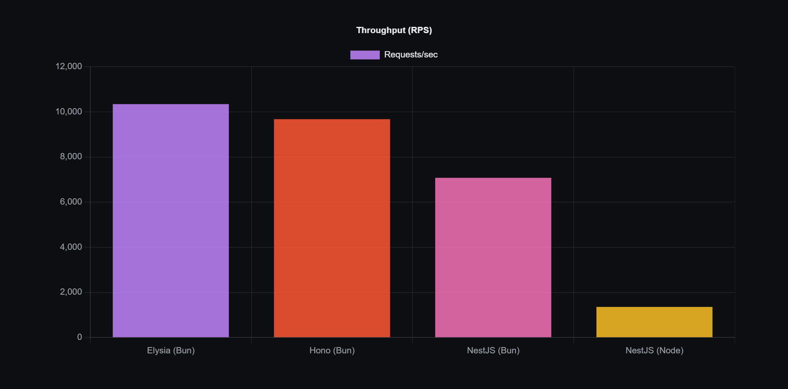

# Backend Framework Benchmark

## Frameworks under test

| Framework | App | Runtime | Port |
|-----------|-----|---------|------|
| [Elysia](https://elysiajs.com/) | `apps/elysia` | Bun | 8080 |
| [Hono](https://hono.dev/) | `apps/hono` | Bun | 8081 |
| [NestJS](https://nestjs.com/) + Fastify | `apps/nestjs` | Bun | 8082 |
| [NestJS](https://nestjs.com/) + Fastify | `apps/nestjs-node` | Node | 8083 |
| [Fiber](https://gofiber.io/) | `apps/fiber` | Go | 8084 |
| [Gin](https://gin-gonic.com/) | `apps/gin` | Go | 8085 |

Results land in `results/*.json`. Compare runs with `bun run compare` (local HTTP server; opening `compare.html` directly via `file://` will not load the JSON files).

## Run Benchmark

### Prompt (for Claude Code, Cursor)

**run this benchmark yourself.** Do not only describe the steps; execute them in the terminal, fix missing tools or env files, and report the outcome.

---

### Human instruction

Setup and usage: [AGENTS.md](AGENTS.md).

### Result

